<h1 align="center">Практика з програмування (Python)</h1>
<p align="center">Яровий Юліан Валерійович ІПЗ-20015Б</p>
<br>
<h2 align="center">Connection ssh</h2>

### Приклади команд

```shell
$ ssh-keygen -t rsa -b 4096 -C "email@"
$ eval "$(ssh-agent -s)"
$ ssh-add ~/.ssh/id_rsa
```
<kbd>
    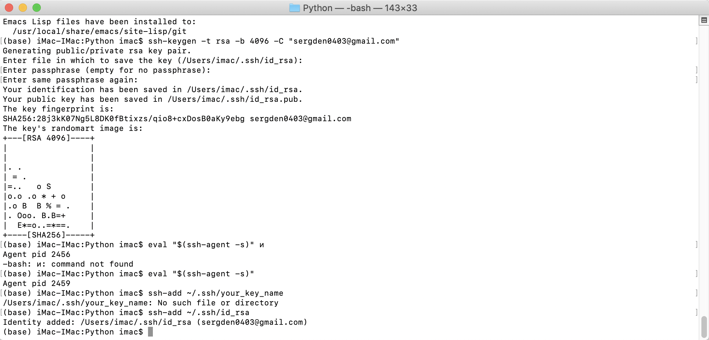
</kbd>
    
<br>
<br>
<hr>

<h2 align="center">Task-0</h2>
<p align="left">Option 1: 1-Form a list of 30 different whole numbers from -100 to + 100. Know the maximum element in the list і th ordinal number. Rewrite the list to add only unpaired numbers on the list, or perhaps, there are no such numbers. Otrimaniy list to put in order the change of elements.</p>

### Приклад

```python
import random
arr = []

for _ in range(0, 30):
    arr.append(random.randint(-100, 100))

print('Array:', arr)
print('Max:', max(arr))

clist = 1
for index, i in enumerate(arr):
    if i == max(arr):
        print('   %s) Index (%s) = %s' % (clist, index, i))
        clist+=1

odd = []
for elt in arr:
    if elt % 2 != 0:
        odd.append(elt)
if len(odd) == 0:
    print('No numbers')
else:
    print('Odd:', sorted(odd, reverse=True))
```

<em><p align="left">Screenshots of program execution are shown below:</p></em>

<kbd>
    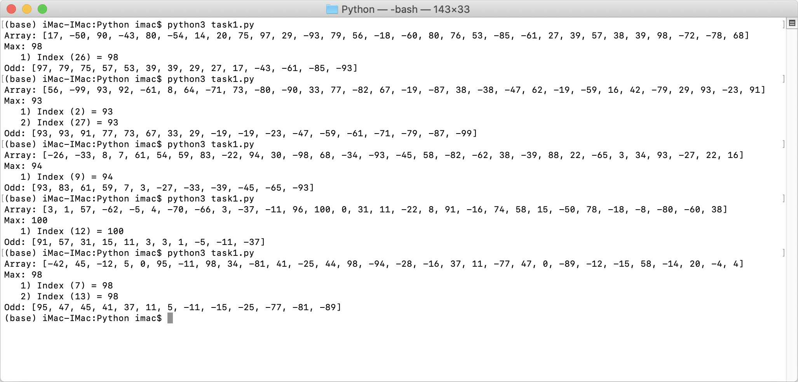
</kbd>
 
<br>
<br>
<p align="left">Option 2: 2-Form a list of 30 different numbers from -100 to + 100. To know the maximum element in the list and the first ordinal number. To bet on all numbers, to stand the order.</p>

### Приклад

```python
import random
arr = []

for _ in range(0, 30):
    arr.append(random.randint(-100, 100))

print('Array:', arr)
print('Max:', max(arr))

clist = 1
for index, i in enumerate(arr):
    if i == max(arr):
        print('   %s) Index (%s) = %s' % (clist, index, i))
        clist+=1

def couples(scr):
    res = []

    variable = 0
    number = 0
    pos = [-1, -1]
    for index, i in enumerate(scr):
        if index == 0:
            variable = i
            pos[0] = index
        else:
            if i == variable:
                number = i
                pos[1] = index
            else:
                if pos[1] - pos[0] > 0:
                    res.append(['+' if number >= 0 else '-', number, [pos[0], pos[1]]])
                variable = i
                pos[0] = index
    return res

res = []
for i in couples(arr):
    pr = []
    if i[0] == '-':
        for _ in range(i[2][1]-i[2][0]+1):
            pr.append(i[1])
        res.append(pr)

print('Couple:', None if len(res) == 0 else res)
```

<br>
<em><p align="left">Screenshots of program execution are shown below:</p></em>

<kbd>
    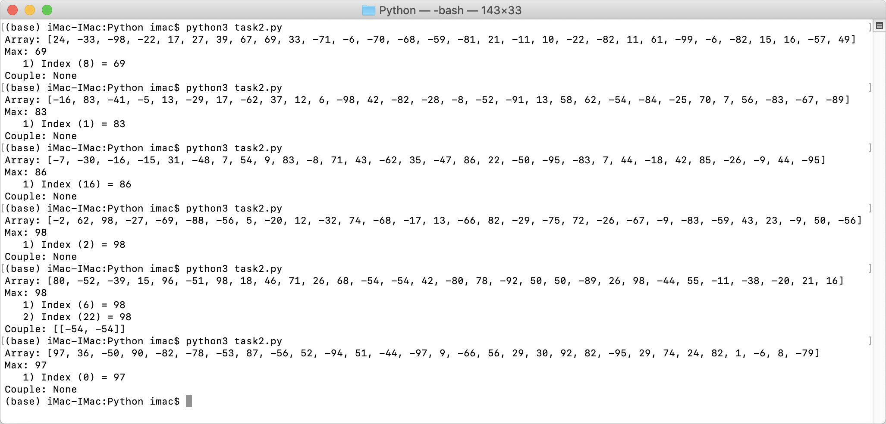
</kbd>

<br>
<br>
<hr>

<h2 align="center">Task-1</h2>

<h3 align="left">Git clone</h3>
<p align="left">Make a git clone of your past repository.</p>

<p align="left">1. Copy url:</p>
<kbd>
    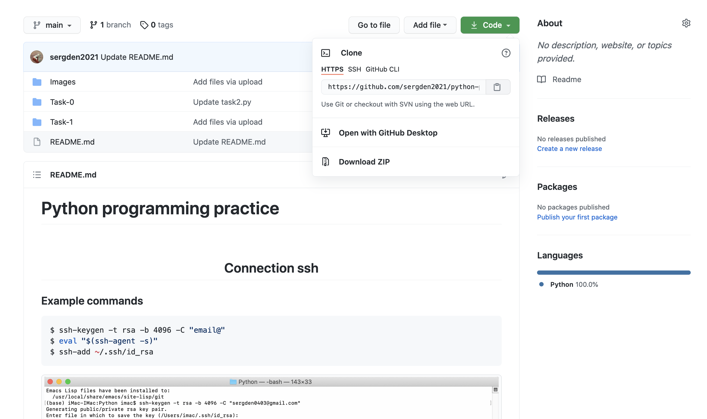
</kbd>

<br>
<br>

<p align="left">2. Entering the command into the terminal:</p>

### Приклад команди

```shell
$ git clone https://github.com/sergden2021/python-practice.git
```

<kbd>
    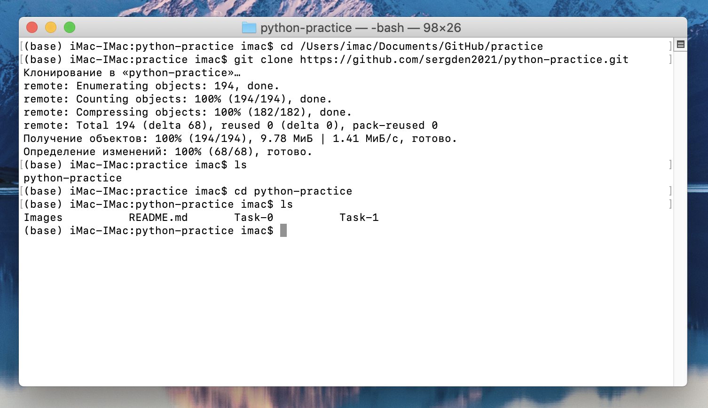
</kbd>

<br>
<br>

<p align="left">3. Task: Create a program, if you enter a row, that sees all the numbers in the surrounding array, for which the program is another row without numbers. and an array of numbers. The change of a row in such a rank, so that the word is skinny in new, was repaired and ended with a great letter. To know the maximum value in the array of numbers, and all of the іnshі numbers are brought to the degree according to the іх index, that is recorded in the first array.</p> 

### Приклад

```python
# Examples line:
# the literal 1e-4 is interpreted as 10 raised to the power -4, which is 1/100, or 0.01.
# if writing int(5.0 / 2) seems a little long winded to you
# what do you think 0.1 + 0.2 is? The answer is 0.3, right?

import random

print('\033[33;1mPlease enter your string:\033[0m ', end='')
line = input()

newline = ''
numarr = []

for index, i in enumerate(line):
    if i >= '0' and i <= '9':
        numarr.append([int(i), int(index)])

for i in line:
    if i >= '0' and i <= '9':
        continue
    else:
        newline += i

print('\n\033[32;1mString without numbers:\033[0m', newline)
print('\033[32;1mString of numbers:\033[0m ', numarr)

words = []
words = line.split()

for index, i in enumerate(words):
    words[index] = words[index][0].upper() + words[index][1:-1] + words[index][-1].upper()
print('\033[32;1mWith a capital letter:\033[0m ', ' '.join(words), '\n')

maxn = -1
for i in numarr:
    if int(i[0]) > maxn:
        maxn = int(i[0])

degreearr = []
for i in numarr:
    if int(i[0]) != maxn:
        degreearr.append([i[0], i[0]**i[1], i[1]])

print('\033[33mMax int in array: ' + str(maxn) + '\033[0m')
print('\033[32;1mRaising numbers to powers by their index ( \033[0m\033[33;1m[number, exponentiation, index], ...\033[0m\033[32;1m ):\033[0m', degreearr)
print('----------   Done!   ----------')
```

<br>
<em><p align="left">An example of running a program with three different introductory sentences:</p></em>

<kbd>
    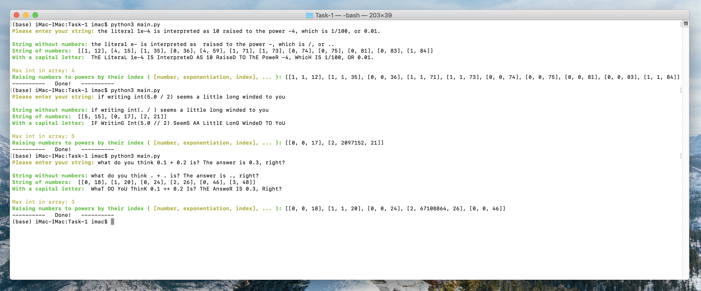
</kbd>

<br>
<br>
<hr>

<h1 align="center">Task-2</h1>

<h3 align="left">Calculator</h3>
<p align="left">Create a window program in which to implement the basic functions of the calculator. (+, -, \, *). 
Implement additional functions in the program. (cos, sin, tan, ctg, log, ln,%)</p>

<p align="left">The appearance of the program on the operating system macos.</p>
<kbd>
    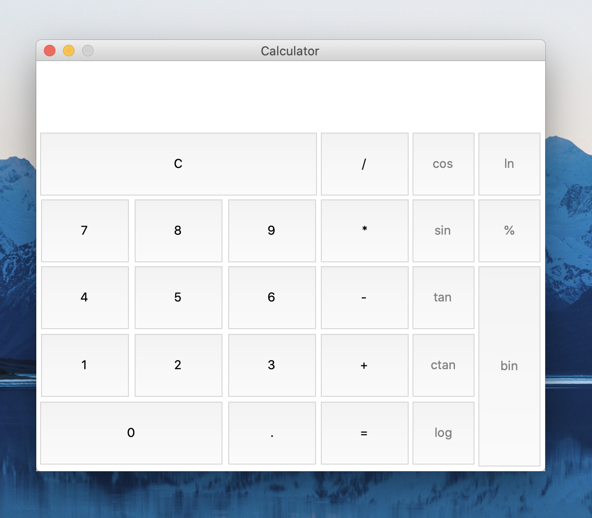
</kbd>

<br>
<br>

<p align="left">1. Testing addition, subtraction, multiplication, division.</p>
<p align="left">1.1 Start</p>

<kbd>
  <br>
  <p align="center" width="100%">
    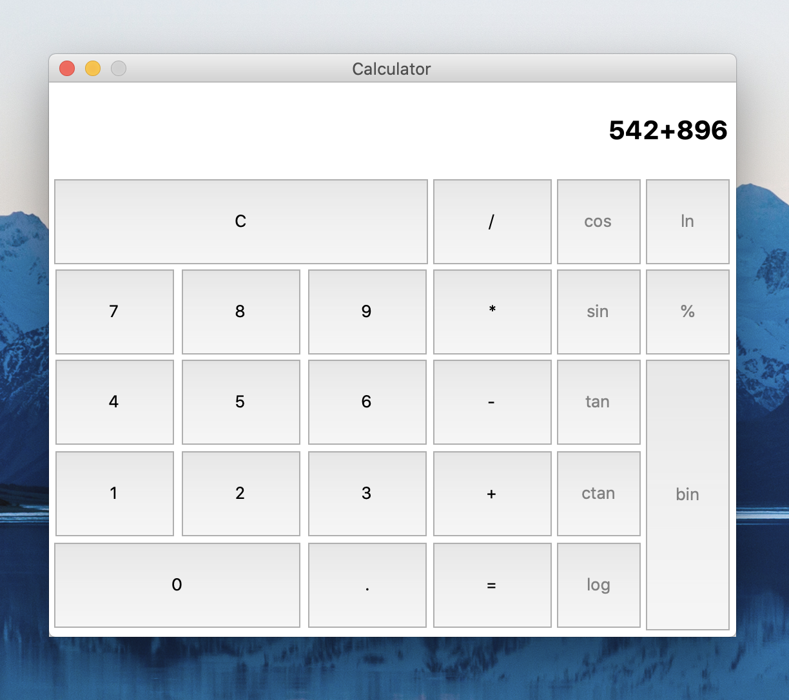
    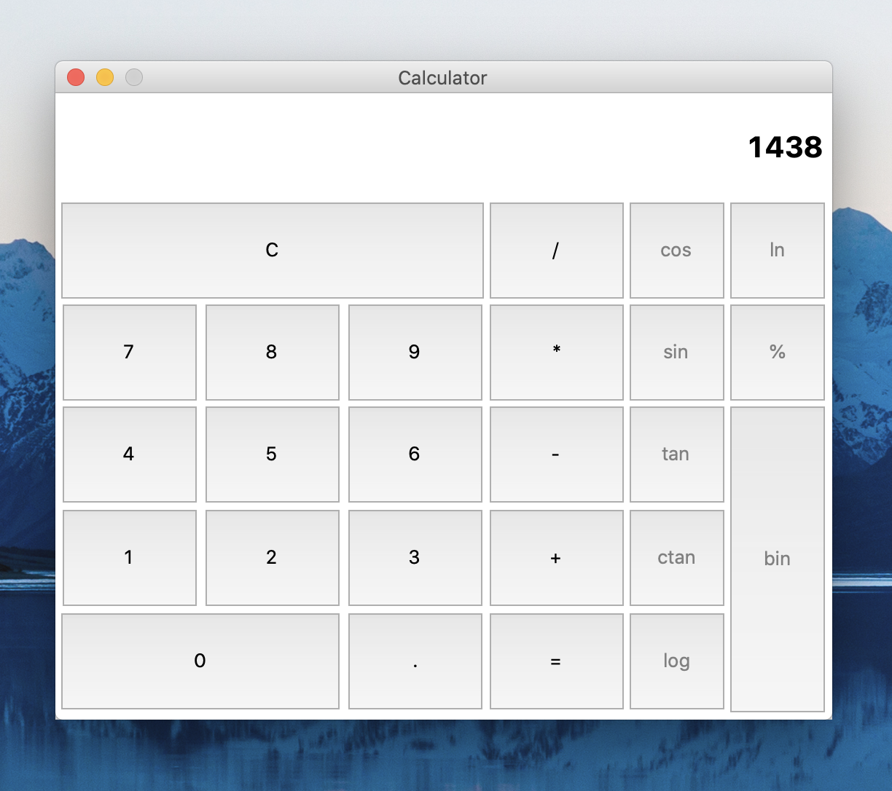
  </p>
</kbd>

<br>
<br>

<p align="left">1.2 Complete example:</p>
<kbd>
    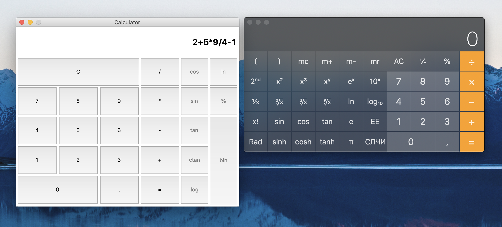
</kbd>

<br>
<br>

<p>Result:</p>
<kbd>
    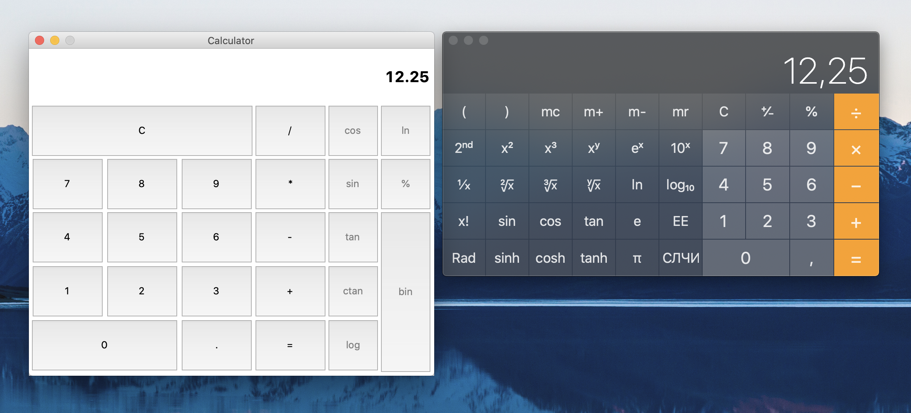
</kbd>

<br>
<br>

<p align="left">2. An example of testing trigonometric functions:</p>
<p align="left">Take Sin 56° = -0.521551002086912</p>

<kbd>
    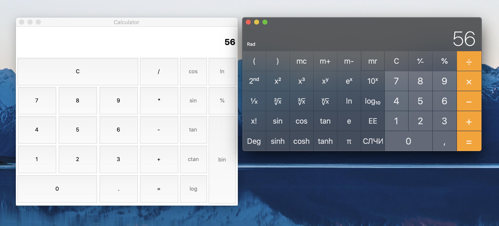
</kbd>

<br>
<br>

<p>Result:</p>
<kbd>
    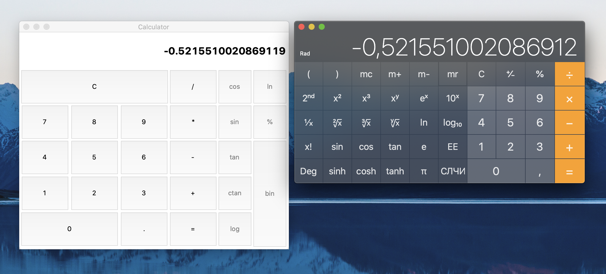
</kbd>

<br>
<br>

<p align="left">3. Converting a number to binary:</p>
<p align="left">For example 5 = 00000101</p>

<kbd>
  <br>
  <p align="center" width="100%">
    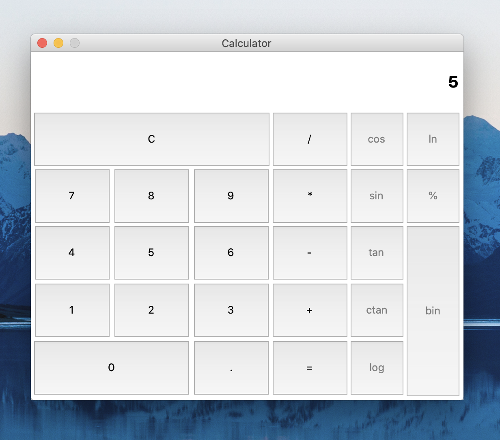
    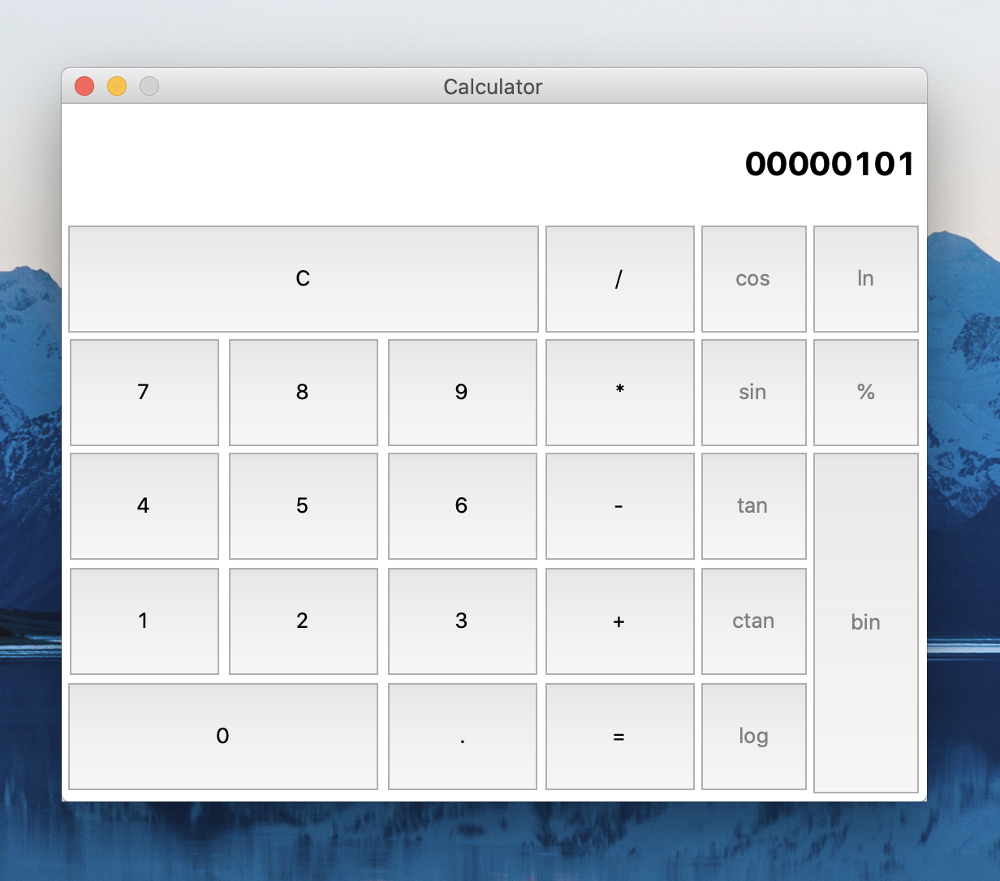
  </p>
</kbd>

### Приклад

```python
from tkinter import *
import math

win = Tk()
win.geometry("533x430")
win.resizable(0, 0)
win.title("Calculator")

def btn_click(item):
    global expression
    expression = expression + str(item)
    input_text.set(expression)

    def bt_clear(): 
    global expression 
    expression = "" 
    input_text.set("")
  
def bt_equal():
    global expression
    result = str(eval(expression))
    input_text.set(result)
    expression = ""


def func_cos():
    global expression
    input_text.set(math.cos(int(expression)) if expression.isdecimal() else 'error')
    expression = ""
 
def func_sin():
    global expression
    input_text.set(math.sin(int(expression)) if expression.isdecimal() else 'error')
    expression = ""
 
def func_tan():
    global expression
    input_text.set(math.tan(int(expression)) if expression.isdecimal() else 'error')
    expression = ""
 
def func_ctan():
    global expression
    input_text.set(math.ctg(int(expression)) if expression.isdecimal() else 'error')
    expression = ""
 
def func_log():
    global expression
    input_text.set(math.log(int(expression)) if expression.isdecimal() else 'error')
    expression = ""
 
def func_ln():
    global expression
    input_text.set(math.ln(int(expression)) if expression.isdecimal() else 'error')
    expression = ""
 
def func_pt():
    global expression
    input_text.set(float(expression)/100 if expression.isdecimal() else 'error')
    expression = ""
 
def to_bin():
    global expression
    input_text.set(bin(int(expression))[2:].zfill(8) if expression.isdecimal() else 'error')
    expression = ""
 
expression = ""
input_text = StringVar()
 
input_frame = Frame(win, width=312, height=50, bd=0, highlightbackground="#fff", highlightcolor="#fff", highlightthickness=1)
input_frame.pack(side=TOP)
 
input_field = Entry(input_frame, font=('calibri', 20, 'bold'), textvariable=input_text, width=50, bg="#fff", bd=0, justify=RIGHT)
input_field.grid(row=0, column=0)
input_field.pack(ipady=20)

btns_frame = Frame(win, width=312, height=272.5, bg="#fff")
btns_frame.pack()
 
clear = Button(btns_frame, text = "C", fg = "black", width = 32, height = 4, bd = 0, bg = "#eee", cursor = "hand2", command = lambda: bt_clear()).grid(row = 0, column = 0, columnspan = 3, padx = 1, pady = 1)
divide = Button(btns_frame, text = "/", fg = "black", width = 10, height = 4, bd = 0, bg = "#eee", cursor = "hand2", command = lambda: btn_click("/")).grid(row = 0, column = 3, padx = 1, pady = 1)
f_cos = Button(btns_frame, text = "cos", fg = "gray", width = 7, height = 4, bd = 0, bg = "#e37b19", cursor = "hand2", command = lambda: func_cos()).grid(row = 0, column = 4, padx = 1, pady = 1)
f_ln = Button(btns_frame, text = "ln", fg = "gray", width = 7, height = 4, bd = 0, bg = "#e37b19", cursor = "hand2", command = lambda: func_ln()).grid(row = 0, column = 5, padx = 1, pady = 1)

seven = Button(btns_frame, text = "7", fg = "black", width = 10, height = 4, bd = 0, bg = "#fff", cursor = "hand2", command = lambda: btn_click(7)).grid(row = 1, column = 0, padx = 1, pady = 1)
eight = Button(btns_frame, text = "8", fg = "black", width = 10, height = 4, bd = 0, bg = "#fff", cursor = "hand2", command = lambda: btn_click(8)).grid(row = 1, column = 1, padx = 1, pady = 1)
nine = Button(btns_frame, text = "9", fg = "black", width = 10, height = 4, bd = 0, bg = "#fff", cursor = "hand2", command = lambda: btn_click(9)).grid(row = 1, column = 2, padx = 1, pady = 1)
multiply = Button(btns_frame, text = "*", fg = "black", width = 10, height = 4, bd = 0, bg = "#eee", cursor = "hand2", command = lambda: btn_click("*")).grid(row = 1, column = 3, padx = 1, pady = 1)
f_sin = Button(btns_frame, text = "sin", fg = "gray", width = 7, height = 4, bd = 0, bg = "#e37b19", cursor = "hand2", command = lambda: func_sin()).grid(row = 1, column = 4, padx = 1, pady = 1)
f_pt = Button(btns_frame, text = "%", fg = "gray", width = 7, height = 4, bd = 0, bg = "#e37b19", cursor = "hand2", command = lambda: func_pt()).grid(row = 1, column = 5, padx = 1, pady = 1)
 
four = Button(btns_frame, text = "4", fg = "black", width = 10, height = 4, bd = 0, bg = "#fff", cursor = "hand2", command = lambda: btn_click(4)).grid(row = 2, column = 0, padx = 1, pady = 1)
five = Button(btns_frame, text = "5", fg = "black", width = 10, height = 4, bd = 0, bg = "#fff", cursor = "hand2", command = lambda: btn_click(5)).grid(row = 2, column = 1, padx = 1, pady = 1)
six = Button(btns_frame, text = "6", fg = "black", width = 10, height = 4, bd = 0, bg = "#fff", cursor = "hand2", command = lambda: btn_click(6)).grid(row = 2, column = 2, padx = 1, pady = 1)
minus = Button(btns_frame, text = "-", fg = "black", width = 10, height = 4, bd = 0, bg = "#eee", cursor = "hand2", command = lambda: btn_click("-")).grid(row = 2, column = 3, padx = 1, pady = 1)
f_tan = Button(btns_frame, text = "tan", fg = "gray", width = 7, height = 4, bd = 0, bg = "#e37b19", cursor = "hand2", command = lambda: func_tan()).grid(row = 2, column = 4, padx = 1, pady = 1)
f_bin = Button(btns_frame, text = "bin", fg = "gray", width = 7, height = 13, bd = 0, bg = "#e37b19", cursor = "hand2", command = lambda: to_bin()).grid(row = 2, column = 5, rowspan = 4, padx = 1, pady = 1)
 
one = Button(btns_frame, text = "1", fg = "black", width = 10, height = 4, bd = 0, bg = "#fff", cursor = "hand2", command = lambda: btn_click(1)).grid(row = 3, column = 0, padx = 1, pady = 1)
two = Button(btns_frame, text = "2", fg = "black", width = 10, height = 4, bd = 0, bg = "#fff", cursor = "hand2", command = lambda: btn_click(2)).grid(row = 3, column = 1, padx = 1, pady = 1)
three = Button(btns_frame, text = "3", fg = "black", width = 10, height = 4, bd = 0, bg = "#fff", cursor = "hand2", command = lambda: btn_click(3)).grid(row = 3, column = 2, padx = 1, pady = 1)
plus = Button(btns_frame, text = "+", fg = "black", width = 10, height = 4, bd = 0, bg = "#eee", cursor = "hand2", command = lambda: btn_click("+")).grid(row = 3, column = 3, padx = 1, pady = 1)
f_ctan = Button(btns_frame, text = "ctan", fg = "gray", width = 7, height = 4, bd = 0, bg = "#e37b19", cursor = "hand2", command = lambda: func_ctan()).grid(row = 3, column = 4, padx = 1, pady = 1)
 
zero = Button(btns_frame, text = "0", fg = "black", width = 21, height = 4, bd = 0, bg = "#fff", cursor = "hand2", command = lambda: btn_click(0)).grid(row = 4, column = 0, columnspan = 2, padx = 1, pady = 1)
point = Button(btns_frame, text = ".", fg = "black", width = 10, height = 4, bd = 0, bg = "#eee", cursor = "hand2", command = lambda: btn_click(".")).grid(row = 4, column = 2, padx = 1, pady = 1)
equals = Button(btns_frame, text = "=", fg = "black", width = 10, height = 4, bd = 0, bg = "#eee", cursor = "hand2", command = lambda: bt_equal()).grid(row = 4, column = 3, padx = 1, pady = 1)
f_log = Button(btns_frame, text = "log", fg = "gray", width = 7, height = 4, bd = 0, bg = "#e37b19", cursor = "hand2", command = lambda: func_log()).grid(row = 4, column = 4, padx = 1, pady = 1)
win.mainloop()
```
<br>
<br>
<hr>

<h1 align="center">Task-3</h1>

<h3 align="left">Viewing statistics on covid-19</h3>
<p align="left">Implement a window application that will provide statistics for 5+ countries, statistics can be taken any total_cases, and so on.</p>

<p align="left">An example of working on an operating system macos</p>
<kbd>
    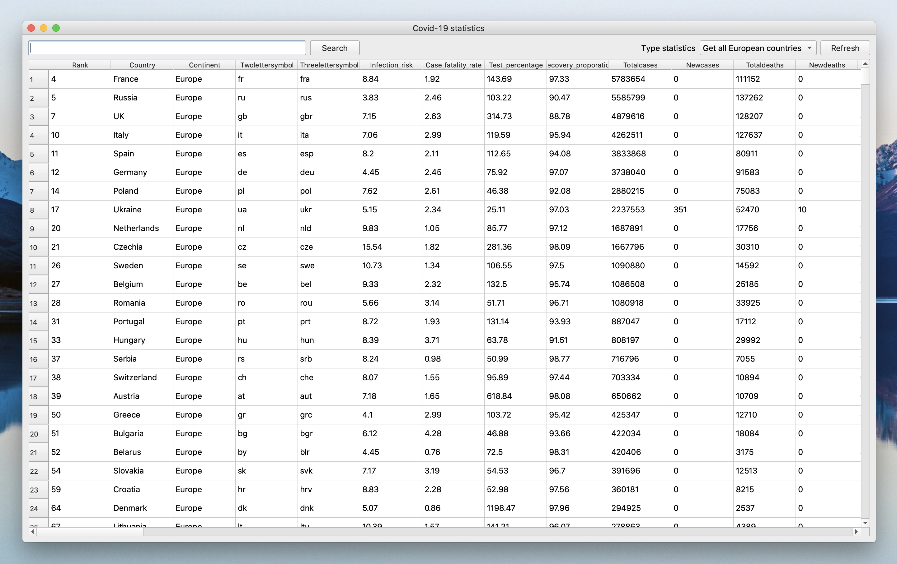
</kbd>

<br>
<br>

<p align="left">1. For a more comfortable work with the graphical interface, PyQt5 was chosen.</p>


### Встановлення PyQt5

```shell
$ pip3 install PyQt5
$ pip3 install pyqt5-tools
```

<br>
<br>

<p align="left">2. First of all, we create an interface in qt designer.</p>
<kbd>
    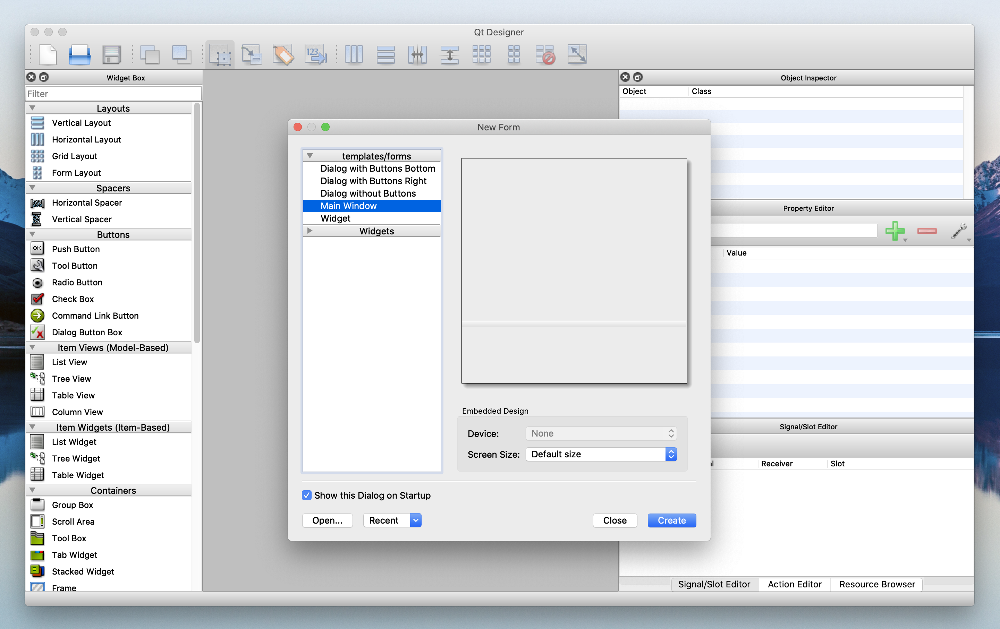
</kbd>

<br>
<br>

<p align="left">3. Then create the user interface by adding all the necessary components.</p>

<kbd>
    
</kbd>

<br>
<br>

<p align="left">4. When the interface is complete. You will need to translate it into (.py) code. To make it easier to build the project later.</p>

### Конвертування (.ui) in (.py)

```shell
$ pyuic5 C19.ui -o C19.py
```
<br>
<br>

<p align="left">5. An example of working with the program.</p>


<br>
<br>

<p align="left">Save file:</p>
<kbd>
    
</kbd>

### Приклад

```python
from os import pread
from PyQt5 import QtWidgets, QtGui, uic, QtCore, QtSerialPort
from PyQt5.QtWidgets import QApplication, QHBoxLayout, QTableView, QWidget, QLabel, QPushButton, QMessageBox, QDialog, QInputDialog, QFileDialog, QLineEdit
from PyQt5.QtGui import QIcon, QPixmap, QImage, QCursor, QPalette, QColor, QStandardItem, QStandardItemModel
from PyQt5.QtCore import Qt, QSize, QDir
from C19 import Ui_MainWindow
from decimal import *
import pyqtgraph as pg
import sys
import requests
import webbrowser
from pathlib import Path

url = "https://vaccovid-coronavirus-vaccine-and-treatment-tracker.p.rapidapi.com/api/npm-covid-data/europe"

headers = {
    'x-rapidapi-key': "01f8a8cfd9mshbca1824dd2b941dp1526f5jsn4e6523312a12",
    'x-rapidapi-host': "vaccovid-coronavirus-vaccine-and-treatment-tracker.p.rapidapi.com"
}

response = requests.request("GET", url, headers=headers)

class Main(QtWidgets.QMainWindow):
    def __init__(self):
        super(Main, self).__init__()
        self.ui = Ui_MainWindow()
        self.ui.setupUi(self)
        
        frameGm = self.frameGeometry()
        screen = QtGui.QApplication.desktop().screenNumber(QtGui.QApplication.desktop().cursor().pos())
        centerPoint = QtGui.QApplication.desktop().screenGeometry(screen).center()
        frameGm.moveCenter(centerPoint)
        self.move(frameGm.topLeft())
        
        self.setWindowFlags(Qt.WindowStaysOnTopHint)

        exceptions = ['id',
                      'one_Caseevery_X_ppl',
                      'one_Deathevery_X_ppl',
                      'one_Testevery_X_ppl',
                      'Deaths_1M_pop',
                      'Serious_Critical',
                      'Tests_1M_Pop',
                      'TotCases_1M_Pop',
                      ]

        def fillingTable():
            response = requests.request("GET", url, headers=headers)
            
            headerarr = []
            mainHarr = []

            self.ui.tableWidget.setColumnCount(100)
            self.ui.tableWidget.setRowCount(1000)

            for i in response.json()[0]:
                if i in exceptions:
                    continue
                else:
                    headerarr.append(i.capitalize())
                    mainHarr.append(i)

            self.ui.tableWidget.setHorizontalHeaderLabels(headerarr)

            for idx in range(len(response.json())):
                counter = 0
                for elin in response.json()[idx]:
                    if elin in exceptions:
                        continue
                    else:
                        self.ui.tableWidget.setItem(idx, counter, QtGui.QTableWidgetItem(str((response.json()[idx])[elin])))
                        counter+=1
                    
        def saveToFile():
            downloads_path = str(Path.home() / 'Downloads')

            f = open(downloads_path + '/C19-Get-all-European-countries(gjvue8e8y7r7r8).txt', 'a')
            f.write(str(response.json()))
            f.close()


        def goToSite():
            webbrowser.open('https://github.com/sergden2021/python-practice', new=2)

        def refreshButton_clicked():
            fillingTable()

        def searchButton_clicked():
            existCountry = False
            
            for i in range(1000):
                try:
                    country = self.ui.tableWidget.item(i, 1).text()
                    if country == self.ui.lineEdit.text():
                        self.ui.tableWidget.selectRow(i)
                        existCountry = True
                except:
                    break

            if existCountry == False:
                msg = QMessageBox()
                msg.setWindowTitle('Error!')
                msg.setText('Such a country has not been found!')
                msg.setIcon(QMessageBox.Warning)
                msg.setStandardButtons(QMessageBox.Ok)
                retval = msg.exec()
                
        self.ui.menubar.setStyleSheet('')

        self.ui.refreshButton.clicked.connect(refreshButton_clicked)
        self.ui.refreshButton.setShortcut('Ctrl+R')
        
        self.ui.searchButton.clicked.connect(searchButton_clicked)
        self.ui.searchButton.setShortcut('Shift+Ctrl+S')

        self.ui.comboBox.clear()
        self.ui.comboBox.addItems(['Get all European countries'])

        def QuitEvent():
            msg = QMessageBox()
            msg.setWindowTitle('Save?')
            msg.setText("You haven't saved your document! Save it? ")
            msg.setIcon(QMessageBox.Warning)
            msg.setStandardButtons(QMessageBox.No | QMessageBox.Yes)
            msg.setDefaultButton(QMessageBox.Yes)
            retval = msg.exec()
            
            if retval == QMessageBox.Yes:
                saveToFile()
            if retval == QMessageBox.No:
                self.close()

        self.ui.actionSave_statistics.triggered.connect(saveToFile)
        self.ui.actionFor_more_informations.triggered.connect(goToSite)

        app.aboutToQuit.connect(QuitEvent)
        QtWidgets.QShortcut(QtGui.QKeySequence('Escape'), self, activated=QuitEvent)

        fillingTable()
        self.show()
        
app = QtWidgets.QApplication(sys.argv)
app.setStyle('Fusion')

window = Main()
app.exec_()
```
<br>
<br>
<hr>

<h1 align="center">Task-4</h1>

<h3 align="left">Viewing statistics on covid-19 in Telegram</h3>
<p align="left">Implement a window application that will provide statistics for 5+ countries, statistics can be taken any total_cases, and so on.</p>

<p align="left">An example of working:</p>
<kbd>
    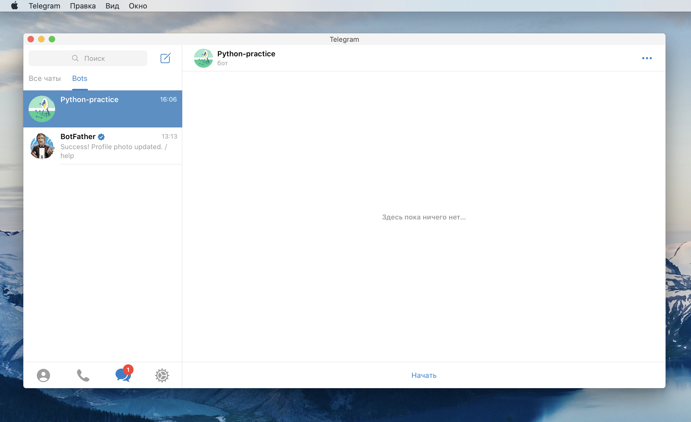
</kbd>

<br>
<br>

### Встановлення pyTelegramBotAPI

```shell
$ pip3 install pyTelegramBotAPI
```

<br>

<h3 align="left">An example of working with the program.</h3>


<br>
<br>

### Приклад

```python
import telebot
import os.path
import numpy as np 
from datetime import datetime
from telebot import types
import webbrowser
import requests
import io

url = "https://vaccovid-coronavirus-vaccine-and-treatment-tracker.p.rapidapi.com/api/npm-covid-data/europe"

headers = {
    'x-rapidapi-key': "01f8a8cfd9mshbca1824dd2b941dp1526f5jsn4e6523312a12",
    'x-rapidapi-host': "vaccovid-coronavirus-vaccine-and-treatment-tracker.p.rapidapi.com"
}

response = requests.request("GET", url, headers=headers)

bot = telebot.TeleBot('TOP SECRET')
print('Start:')

mainHarr = []
for i in response.json():
    mainHarr.append(i['Country'])

@bot.message_handler(commands=['start'])
def welcome(message):
    # keyboard
    markup = types.ReplyKeyboardMarkup(resize_keyboard=True)

    btn1 = types.KeyboardButton('Send me the statistics file')
    btn2 = types.KeyboardButton('Refresh')
    markup.add(btn1, btn2)
    
    bot.send_photo(message.chat.id, photo=open('images/covid.png', 'rb'))
    bot.send_message(message.chat.id, '<b>Welcome.</b> Here you can get the latest information on coronavirus statistics in different countries.\nFor more information, enter the command ( /help ). '.format(message.from_user, bot.get_me()), parse_mode='html', reply_markup=markup)
 
@bot.message_handler(content_types=['text'])
def lalala(message):
    global response
    markup = types.ReplyKeyboardMarkup(resize_keyboard=True)

    if message.chat.type == 'private':
        msg = message.text

        if msg == '/help':
            bot.send_message(message.chat.id, '<b>All available commands:</b>\n1. /Visit_the_site\n2. /Refresh\n3. /Send_me_the_statistics_file'.format(message.from_user, bot.get_me()), parse_mode='html', reply_markup=markup)
        elif msg == '/Visit_the_site':
            webbrowser.open('https://github.com/sergden2021/python-practice', new=2)
        elif msg == '/Send_me_the_statistics_file' or msg == 'Send me the statistics file':
            file_obj = io.BytesIO(bytearray(str(response.json()).encode()))
            file_obj.name = "Сoronavirus-statistics.txt"
            bot.send_document(message.chat.id, file_obj)
        elif msg == '/Refresh' or msg == 'Refresh':
            response = requests.request("GET", url, headers=headers)
            bot.send_message(message.chat.id, 'Done')
        elif msg in mainHarr:
            index = mainHarr.index(msg)
            print(response.json()[index])
            bot.send_message(message.chat.id, ('Rank: ' + str(response.json()[index]['rank']) + ', Infection_Risk: ' + str(response.json()[index]['Infection_Risk']) + ', Total cases: ' + str(response.json()[index]['TotalCases'])))

@bot.callback_query_handler(func=lambda call: True)
def callback_inline(call):
    try:
        if call.message:
            pass

    except Exception as e:
        print(repr(e))
 
bot.polling(none_stop=True)
```
